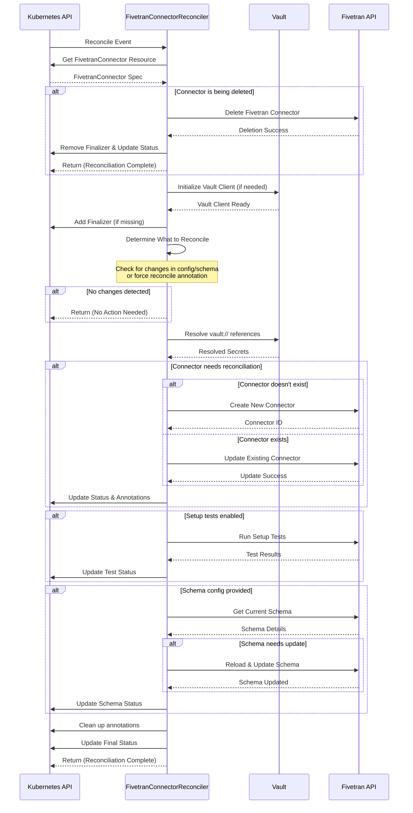

# FivetranConnector Reconciliation Sequence Diagram

This high-level sequence diagram shows the main flow of the FivetranConnector reconciliation process, focusing on the key phases and external system interactions.

## Reconciliation Flow Overview

The FivetranConnector reconciliation follows these **9 main phases**:

### 1. **Initial Setup**
- Controller receives reconcile event from Kubernetes
- Fetches the FivetranConnector resource specification

### 2. **Deletion Handling** 
- If connector is being deleted, removes it from Fivetran and cleans up
- Early exit after successful deletion

### 3. **Initialize Dependencies**
- Sets up Vault client for secret management (if needed)
- Ensures finalizer is present to handle cleanup

### 4. **Determine Work Needed**
- Checks if configuration or schema has changed
- Supports force reconcile via annotation
- Skips work if no changes detected

### 5. **Secret Resolution**
- Resolves any `vault://` references in connector config/auth
- Retrieves secrets securely from Vault

### 6. **Connector Reconciliation**
- **Creates** new connector in Fivetran (if doesn't exist)
- **Updates** existing connector configuration (if changed)
- Updates Kubernetes status with connector details

### 7. **Setup Tests** _(Optional)_
- Runs Fivetran setup tests to validate connectivity
- Reports test results in connector status

### 8. **Schema Configuration** _(Optional)_
- Manages table/column selection and sync settings
- Reloads schema from source if needed
- Applies user-defined schema configuration

### 9. **Final Steps**
- Removes temporary annotations and labels
- Updates final status conditions
- Completes reconciliation cycle

## Key Features

- **Smart Change Detection**: Only reconciles when changes are detected
- **Secure Secret Management**: Integration with Vault for credentials
- **Error Handling**: Proper status reporting and retry logic
